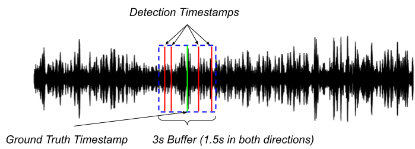
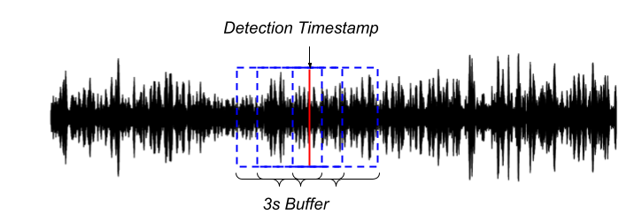
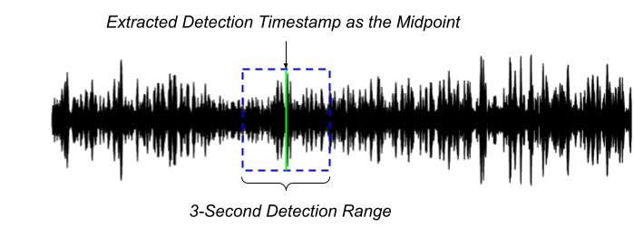

# Task 2-a - Detecting North Atlantic right whales in different envirionments

## Introduction

The goal of this task is to produce a model that is able to detect North Atlantic right whale (NARW) upcalls accross multiple soundscapes with a reasonable performance. The training dataset is a collection of recordings obtained in the Gulf of Maine (DCLDE 2013) and the test dataset are recordings collected in the Gulf of St. Lawrence. This task emphasizes the importance of data preparation and training strategies to create models that can generalize well to different underwater environments.


## Task Description

### Objective
The objective is to train models on the DCLDE 2013 dataset and assess their ability to generalize to unseen data from the Gulf of St. Lawrence by accurately detecting NARW upcalls.

### Data

The training data for this task is derived from the DCLDE 2013 dataset, specifically the selection that contains North Atlantic right whale (NARW) upcalls. The original dataset can be accessed here: [DCLDE 2013 dataset page](https://research-portal.st-andrews.ac.uk/en/datasets/dclde-2013-workshop-dataset).

The test data was collected in the Gulf of St. Lawrence and is a subset of the data used in a recent publication, which can be reviewed [here](https://pubs.aip.org/asa/jasa/article/147/4/2636/1058640/Performance-of-a-deep-neural-network-at-detecting). The original data set from this publication is available [here](https://doi.org/10.20383/101.0241).


Both the training and test data have been reorganized and are available in a single downloadable package.


### Data Annotation
The annotations for the training set have been standardized as follows:

| filename | start | end |
| ------- | ------ | ---- |

Where:
- `filename`: Name of the file containing a NARW upcall.
- `start`: Start time in seconds from the beginning of the file where the upcall begins.
- `end`: End time in seconds where the upcall concludes.

Annotations labeled as uncertain have been excluded from the dataset. Additional dataset details are available on the [DCLDE 2013 dataset page](https://research-portal.st-andrews.ac.uk/en/datasets/dclde-2013-workshop-dataset).

For instance:

Consider an audio file named `NARW_20230601_0845.wav` containing a detected North Atlantic right whale upcall. The annotation for this file in the dataset might look like this:

| filename                  | start | end  |
|---------------------------|-------|------|
| NARW_20230601_0845.wav    | 123.5   | 125.2  |

Where:
- `filename`: `NARW_20230601_0845.wav` is the name of the audio file.
- `start`: `123.5` seconds is the time from the start of the audio file when the NARW upcall begins.
- `end`: `125.2` seconds is the time when the upcall ends.


The annotations for the test set include:

| filename   | timestamp |
| ---------- | --------- |

Where:
- `filename`: The name of the file where the detection occurred.
- `timestamp`: The detection time from the start of the file.

You may find both train an test set annotatiosn in the annotations folder.


### Model Requirements

Participants are free to employ any preprocessing technique and network architecture. The onyl requirement is that the final output of your model MUST be a CSV file formatted as follows:

| filename   | timestamp |
| ---------- | --------- |
Where:
- `filename`: The name of the file where the detection occurred.
- `timestamp`: The detection time from the start of the file.

A 1.5-second buffer will be applied, where detections within this range from the annotation will be considered a true positive.

Please see the examples in this page for a more in depth discussion on how to provide the timestamps.

### Model Evaluation

Models will be evaluated based on precision, recall, F1 score, and false positive rate (FPR) per hour of recording. The test set includes 25 hours of recordings at 32KHz, with 1157 annotated NARW upcalls.

#### Performance Metrics

Please compute the performance metrics using the provided `metrics.py` script as follows:

```shell
python metrics.py annotations/annotations_test.csv detections.csv
```

If you are using a Windows operating system, you will need to replace the forward slashes (`/`) in the directory paths with backslashes (`\`).

A True Positive (TP) is recorded when a detection timestamp intersects with a ground truth buffer. A False Positive (FP) is incremented when a detection timestamp does not overlap with any ground truth buffer. Finally a False Negative (FN) is noted when there is a ground truth event that does not have a corresponding detection timestamp.

Note: The true positive count will only be incremented once per detection timestamp. For instance if multiple detection timestamps aligns with only one ground truth, the true positive count will be incremented only once. Similarly, if one detection timestamp aligns with multiple ground truths, the true positive count will be incremented for each ground truth.

The following images illustrates these scenarios:



In the image above, several detection timestamps are indicated by red lines, all of which fall within the same ground truth buffer marked by a green line and a blue box. Under this scenario, the count of true positives will be incremented only once, despite multiple detections.



In the image above, a single detection timestamp (red line) intersects with several ground truth buffers (blue boxes). In this case, the count of true positives will be incremented for each ground truth that the detection timestamp overlaps, despite there being "only one" detection.

This task aims to challenge and assess the ability of models to adapt and perform in varying acoustic environments, reflecting the real-world variability encountered in marine mammal monitoring.

# Sample Code

We have prepared a sample code to serve as an example and to provide general guidance for approaching the challenge. This approach is intended solely as a reference, and you are not required to follow any specific steps outlined in it, except for running the metrics file. Nonetheless, this serves as a useful guideline for participating in the challenge.


## Requirements

Python > 3.9.10

It is recommended to create a new python environment to run the code and install the dependencies.

Install the dependencies with:

```
pip install -r requirements.txt
```

To run the code simply issue the commands in your CLI. Ensure you are in the correct working directory. Remember that if you are using a Windows operating system, you will need to replace the forward slashes (`/`) in the directory paths with backslashes (`\`).

## Outline

In this example, a simple 2-layer CNN will be trained to classify 3-second audio segments as either containing a NARW upcall or not. Below is a detailed outline of the process:


1. **Data Preprocessing**: Segments of 3 seconds that contain NARW upcalls, as well as random 3-second segments of background noise, are extracted from the training dataset. These audio segments are then converted into spectrogram representations and stored in an HDF5 database to ensure efficient access during training.
2. **CNN Training**: The CNN is trained using the prepared HDF5 dataset over a few epochs.
3. **Classifier Application**: The trained CNN is applied to the entirety of the test wave files using a sliding window approach. Detections that exceed a 0.5 detection threshold for the upcall class are recorded.
4. **Performance Measurement**: The detections are evaluated against the ground truth annotations for the test dataset.


Each stage of the process is encapsulated in its own Python script:
- `create_db.py` — For data preprocessing and database creation.
- `train_cnn.py` — For CNN training.
- `run_cnn.py` — For the application of the CNN classifier on test data.
- `metrics.py` — For the calculation of performance metrics.

The configuration for the spectrogram is specified in the `spec_config.json` file. Each script contains detailed comments and can be executed via the OS CLI, as outlined in the sections below. Participants are allowed to reuse and modify any part of the code for their needs.

## Creating the database

To create the database, we will use the `create_db.py` script. For this sample code, the training dataset will be split into a training set and a validation set. The DCLDE 2013 dataset contains audio recordings with upcalls for seven days. Each of these days is stored in its own folder. For example, the folder `NOPP6_EST_20090328` contains one day of recordings, while `NOPP6_EST_20090329` contains a second day of recordings.

We will split the train/val set temporally, reserving the first four days for training and the final three days for validation. The script will extract 3-second long segments based on the NARW annotations to add to the HDF5 database. Additionally, 3-second long segments representing the background environment will be randomly extracted from the data while avoiding the annotated upcalls and added to the HDF5 database. An equal amount of upcall and background samples will be extracted.

### Creating the Training Dataset

Run the following command to create the training database:

```shell
python create_db.py dclde/ spec_config.json annotations/annotations_trainval.csv --table_name /train --exclude_subdirs NOPP6_EST_20090403 NOPP6_EST_20090401 NOPP6_EST_20090402 --output task1.h5 --seed 0
```

### Parameters Explained

- `dclde/`: The path to the directory where the DCLDE data is stored.
- `spec_config.json`: The path to the spectrogram configuration file.
- `annotations/annotations_trainval.csv`: The path to the training annotations file.
- `--table_name /train`: Specifies that the table name in the HDF5 file.
- `--exclude_subdirs`: Specifies the folders to exclude from extraction. In this case, we are excluding the last 3 day folders as they will be used for validation.
    - `NOPP6_EST_20090403`
    - `NOPP6_EST_20090401`
    - `NOPP6_EST_20090402`
- `--output task1.h5`: The name of the output HDF5 file.
- `--seed`: The random number generator seed. By default, none is used. Here we are specifying a seed to ensure consistency.

### Creating the Validation Dataset

Next, run the following command to create the validation database, excluding the folders used for training:

```shell
python create_db.py dclde/ spec_config.json annotations/annotations_trainval.csv --table_name /val --exclude_subdirs NOPP6_EST_20090330 NOPP6_EST_20090329 NOPP6_EST_20090328 NOPP6_EST_20090331 --output task1.h5
```
### Parameters Explained

- `dclde/`: The path to the directory where the DCLDE data is stored.
- `spec_config.json`: The path to the spectrogram configuration file.
- `annotations/annotations_trainval.csv`: The path to the training annotations file.
- `--table_name /val`: Specifies that the table name in the HDF5 file.
- `--exclude_subdirs`: Specifies the folders to exclude from extraction. Now, we want to exclude the first 4 day folders used for training.
    - `NOPP6_EST_20090330`
    - `NOPP6_EST_20090329`
    - `NOPP6_EST_20090328`
    - `NOPP6_EST_20090331`
- `--output task1.h5`: The name of the output HDF5 file. Note that we are appending the validation data to the same file we stored the training data, but on a different table.

Make sure to adjust the paths to the locations where you downloaded the DCLDE data and the annotation files. The `exclude_subdirs` parameter ensures that the script does not extract any segments from the specified folders.

## Train a Model

Now, a simple 2-layer CNN will be trained to classify 3-second audio segments as either containing a NARW upcall or not. Details on the implementation can be found in the train_cnn.py script.

To train the model, run the following command:

```shell
python train_cnn.py task1.h5 --train_table /train --val_table /val --epochs 10 --batch_size 64 --output_folder trained_models/
```

### Parameters Explained

- `task1.h5`: The HDF5 database file containing the training and validation data that was created in the previous step.
- `--train_table /train`: Specifies the HDF5 table to use for training.
- `--val_table /val`: Specifies the HDF5 table to use for validation.
- `--epochs 10`: The number of training epochs.
- `--batch_size 64`: The batch size for training.
- `--output_folder trained_models/`: The directory where the trained model will be saved.

## Run the Model

Next, we need to run the model trained in the previous step on the test data from the GSL and save these detections in a CSV file.

Since our model operates on 3-second segments, to comply with the challenge specification that the detection CSV file is formatted with a filename and timestamp, we must extract a timestamp from a 3-second detection window. While different design decisions can be made here, we will use a simplistic approach of extracting the midpoint of the 3-second detection segment as the timestamp. This is represented in the image below.




Other approaches can be taken, and participants are encouraged to use any method they see fit for their model.

For the purposes of htis sample code, to run the model on a dicretory of audio files:

```shell
python run_cnn.py gsl/ trained_models/ spec_config.json --output_csv="detections.csv" --threshold=0.5
```

### Parameters Explained

- `gsl/`: The directory containing the test audio files from the Gulf of St. Lawrence.
- `trained_models/`: The directory containing the trained model from the previous step.
- `spec_config.json`: The spectrogram configuration file used to create the database.
- `--output_csv detections.csv`: The name of the output CSV file where detections will be saved.
- `--threshold 0.5`: The detection threshold.

## Evaluate on test data

Finally, please use the the `metrics.py` script to compute the final evaluation metrics of the detector on the test dataset. All participants will be evaluated in the same manner.

```shell
python metrics.py annotations/annotations_test.csv detections.csv
```

### Parameters Explained

- `annotations/annotations_test.csv`: The path to the test annotations file.
- `detections.csv`: The path to the CSV file containing the model's detections obtained in the previous step.